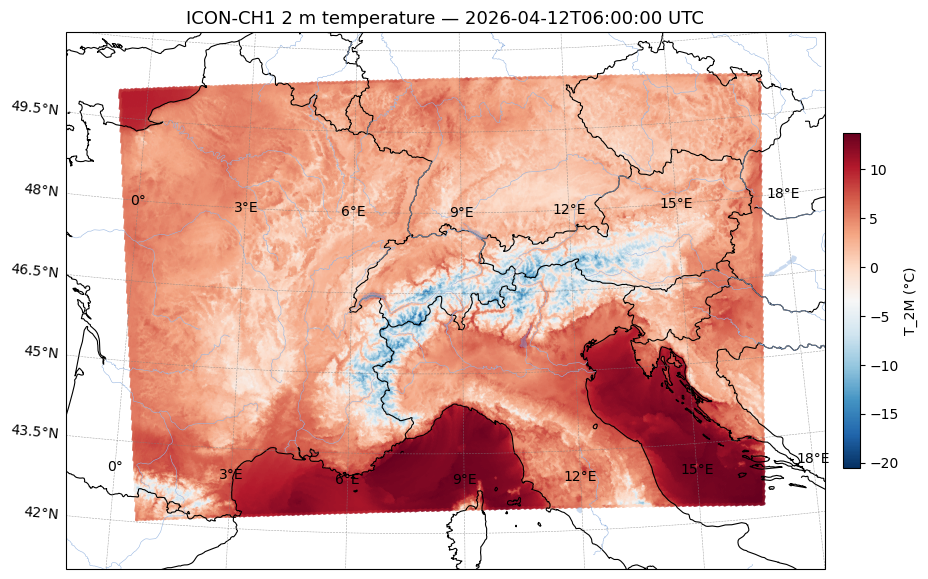

[](https://github.com/martibosch/meteoswiss-nwp-arraylake/blob/main/LICENSE)

# MeteoSwiss NWP ArrayLake

A rolling window of [ICON-CH](https://www.meteoswiss.admin.ch/weather/weather-and-climate-from-a-to-z/icon.html) and [KENDA-CH1](https://opendatadocs.meteoswiss.ch/e-forecast-data) analysis snapshots on [ArrayLake-managed icechunk](https://docs.earthmover.io), sized to stay within the [Community tier](https://www.earthmover.io/blog/announcing-arraylake-community-tier) (10 GB managed storage, 1 private repo, 50 compute credits/month) and published to the [Earthmover Marketplace](https://docs.earthmover.io/marketplace).



*ICON-CH1 2 m temperature at 1 km resolution over Switzerland. Reproduced from [`notebooks/store-access.ipynb`](notebooks/store-access.ipynb).*

```
MeteoSwiss OGD API
      │
      │  meteodatalab (per variable, per model run)
      ▼
┌──────────────────────┐  configurable schedule per product
│   Modal cron job     │  probe ref_time → dedup check → fetch
│  meteoswiss_nwp_     │            → prune to window → write
│    arraylake.ingest  │
└──────────┬───────────┘
           │  ArrayLake-managed icechunk (zarr v3, git-like versioning)
           ▼
┌──────────────────────────────────────────┐
│   one managed repo, multiple zarr groups │
│                                          │
│   ch2-ml   ch2-sfc   ch1-sfc   kenda-sfc │
│   each a key-variable subset with a      │
│   rolling ref_time window                │
└──────────────────────────────────────────┘
           │
           └── Marketplace listing (free) → direct subscriptions
                          │
                          └── xarray.open_zarr(repo.readonly_session("main").store)
```

> This is the public, Marketplace-facing counterpart to [`meteoswiss-nwp-store`](https://github.com/martibosch/meteoswiss-nwp-store), the personal full-variable operational archive on Tigris. The OGD fetching helpers in `ingest.py` are duplicated from that repo by design; see the module docstring.

## Products

A single ArrayLake repo holds four zarr groups, each with its own key-variable subset and rolling `ref_time` window:

| Group       | Product                     | Cadence | Window | Variables                                           |
| ----------- | --------------------------- | ------- | ------ | -------------------------------------------------- |
| `ch2-ml`    | ICON-CH2-EPS multi-level    | 6 h     | 6      | `T`, `U`, `V`                                      |
| `ch2-sfc`   | ICON-CH2-EPS surface        | 6 h     | 6      | `T_2M`, `TD_2M`, `U_10M`, `V_10M`, `PMSL`, `TOT_PREC` |
| `ch1-sfc`   | ICON-CH1-EPS surface        | 3 h     | 8      | `T_2M`, `TD_2M`, `U_10M`, `V_10M`, `PMSL`, `TOT_PREC` |
| `kenda-sfc` | KENDA-CH1 analysis (E5) sfc | 1 h     | 24     | `T_2M`, `TD_2M`, `U_10M`, `V_10M`, `PMSL`, `TOT_PREC` |

Variable subsets are chosen so that a meaningful rolling window fits the 10 GB managed-storage cap. Each tick appends the new snapshot and prunes the group to its trailing window in a single `to_zarr` write; physical reclamation of old chunks is handled by ArrayLake's automatic expiration and garbage collection on configured repos.

Modal remains the scheduler: ArrayLake Compute is billed per hour of uptime and scales to zero after 15 minutes of inactivity, so it cannot replace the timed cron job, and the 50 monthly credits do not cover an always-on ingest loop.

## Setup

### Required accounts and credentials

| Service                                | Purpose                          | Required |
| -------------------------------------- | -------------------------------- | -------- |
| [Modal](https://modal.com)             | Serverless compute for cron jobs | Yes      |
| [ArrayLake](https://app.earthmover.io) | Managed icechunk storage         | Yes      |

### 1. Install pixi

```bash
curl -fsSL https://pixi.sh/install.sh | sh
pixi install
```

The project uses two Pixi environments:

- `default` — dev tooling, `arraylake`, and `modal-client` for running Modal CLI commands.
- `notebook` — Jupyter, Matplotlib, Cartopy and data-access deps for demo notebooks.

### 2. Configure Modal

```bash
pixi run modal setup
```

Create a Modal secret named `meteoswiss-arraylake` from a `.env` file (see the [Modal secrets docs](https://modal.com/docs/cli/latest/secret)):

```bash
cat > meteoswiss-arraylake.env <<'EOF'
ARRAYLAKE_TOKEN=<personal access token>
ARRAYLAKE_ORG=<org name, e.g. martibosch>
ARRAYLAKE_REPO=meteoswiss-nwp-anl
EOF
pixi run modal secret create meteoswiss-arraylake --from-dotenv meteoswiss-arraylake.env
```

### 3. Create the managed repo

```bash
pixi run just create-repo
```

### 4. Deploy the cron jobs

```bash
pixi run just deploy
```

This registers four scheduled Modal functions (CH2 every 6 h, CH1 every 3 h, KENDA every 1 h). Stop them at any time with:

```bash
pixi run just stop
```

### 5. Trigger a manual ingestion (optional)

```bash
pixi run just ingest ch2-ml
```

## Publish to the Earthmover Marketplace (one-time, web UI)

Publishing is **not** automatable by a Modal job — it requires a Professional-tier organization and is done through the web UI at `app.earthmover.io`:

1. Email `support@earthmover.io` to upgrade your organization to the Professional tier (required to act as a Data Provider).
2. In your organization's **Marketplace** tab, click **+ Create Listing**.
3. Select the `meteoswiss-nwp-anl` repo, set **Status** to *Published*, **Pricing Model** to *Free* (free listings include all variables and groups; subscribers read directly from your store and see your commit history), and fill in the description, thumbnail, README, and license.
4. Once published, any ArrayLake user can subscribe from the Marketplace and open the rolling-window analysis store as a standard zarr repo:

```python
import arraylake
import xarray as xr

client = arraylake.Client()
repo = client.get_repo("martibosch/meteoswiss-nwp-anl")
ds = xr.open_zarr(repo.readonly_session("main").store["ch2-sfc"], consolidated=False)
```

> Because free listings serve subscribers directly from your object store, enable ArrayLake's automatic expiration + garbage collection on the repo so storage and egress stay bounded as the window rolls. `just gc` is a best-effort manual fallback.

## Cost estimation

Rough monthly figures against the Community tier's 10 GB managed storage and 50 compute credits.

### Storage

| Group       | Approx. size/run | Runs/month | Total     |
| ----------- | ---------------- | ---------- | --------- |
| `ch2-ml`    | ~25 MB           | 120        | ~3 GB     |
| `ch2-sfc`   | ~3 MB            | 120        | ~0.4 GB   |
| `ch1-sfc`   | ~7 MB            | 240        | ~1.7 GB   |
| `kenda-sfc` | ~7 MB            | 720        | ~5 GB     |
| **Total**   |                  |            | **~10 GB** |

The window lengths above are tuned to land near the cap; trim them (in `PRODUCTS` in `ingest.py`) for headroom.

### Compute (Modal)

Each ingestion run takes up to 10 minutes (timeout). Across all four products that is ~1 200 runs/month, or ~12 000 container-minutes at the worst case — in practice ingestion completes well under 10 minutes. Modal's free tier ($30/month credit) covers this for a new account.
